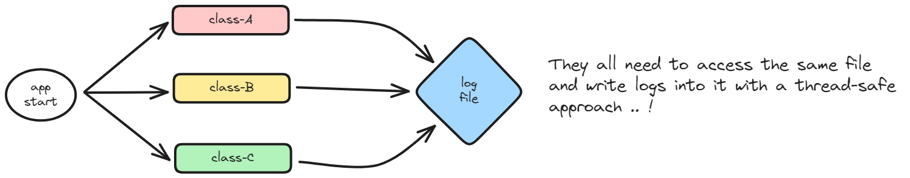
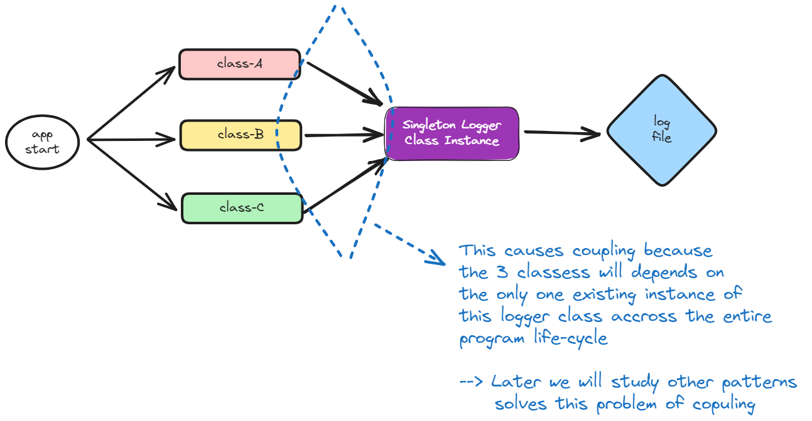
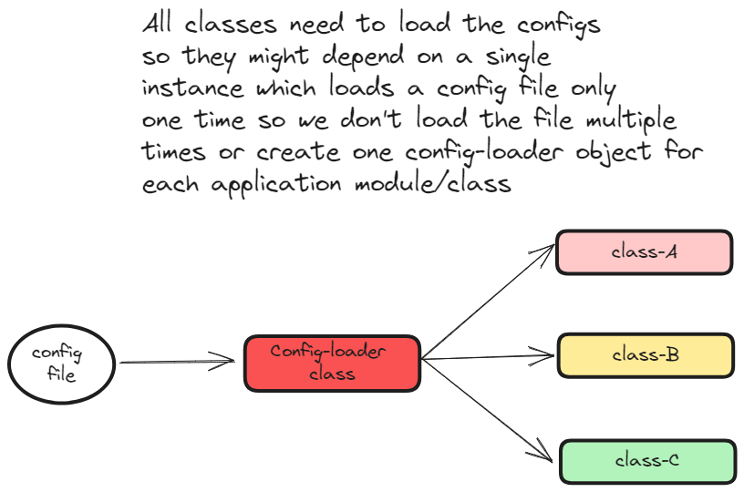

# How to implement Singleton pattern ? 
- Make your class private "private constuctor" so no class in other packages can create new instance from it.
```go
// the type is private so client code cannot instantiate it
type singleton struct {
	// whatever the fields we need to define here
	val int
}
```
- Define one private global instance (or static field in case of oop lang) and this will hold the only single created instance of this class.
```go
var instance *singleton

// to manage synconrization
var once sync.Once
```
- Define one public exposed method which returns the instance of this class.
```go
func GetSingletonInstance() *singleton {
	// check if this instance is not created before
	if instance != nil {
		// if its created => return the existing instance
		return instance
	} else {
		// if its not created before => create a new instance and return it
		once.Do(
			func() {
				instance = &singleton{
					val: 0,
				}
			})
		return instance
	}
}
```
- Define getter/setter on this class to access its property.
```go
func (s *singleton) Val() int {
	return s.val
}

func (s *singleton) SetVal(v int) {
	s.val = v
}
```

# When to use the Singleton pattern ? 
➜ Its used when you find that you need to use a `global variable` which holds some data that need to be accessed by many modules. <br>

➜ Its used when you find yourself dealing with a `shared resource` and all modules need to access the resource/s and find the same value of update the resource/s.<br> <t> 

- Shared Cache Memory <br> 

➜ Its used when we need to make a `database connection` or any other `resource connection` because we don't want to make this connection request again and again ! <br>

# Use-Cases :
1. Logger usecase :



Solution : 



2. Configs Loader usecase :

 