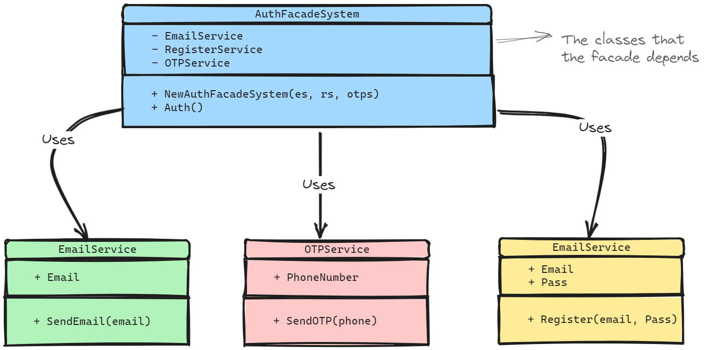

# Facade Pattern 

### Architecture

### Advantages 
- Facade pattern provides simple interface to client, so it achieves the decoupling between client and the complex system 
- Facade pattern provides that if the sub-system internals are changed, the client won't be affected because the facade's api provided to the client is the same, and if we changed the api structure, we will make the change in the client in only one place, but if we used the internal classes inside the client directly, if we changed all the classes will change in multiple locations in the client code.